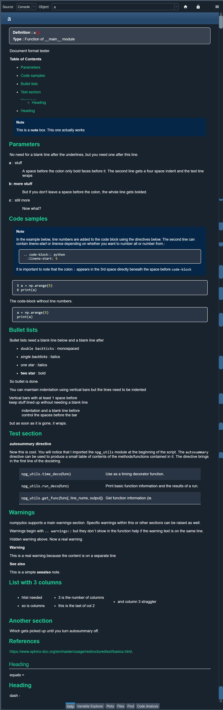

## Function doc strings ##

Here is some code with way more docstring information than is needed for a python function.  

I tried to pack in all that might be useful.

A few tips ahead of time.
  - image location can be done in several ways
    -  `<a href="url"></a>`
    -  `[image info text here](../path/if_needed/image_name.png)`  partial path relative to the \*.md file
    -  `[image info text here](image_name.png here)`  same folder as the \*.md file
  - to prevent wrapping text to the right or left of an image use `<br clear="all">` after the image name.


The image ...

<a href="url"></a>

<br clear="all">

----
... and the code.
 
```python
# ----------------------------------------------------------------------
# ---- (6) doc_frmts .... code section ----
def a():
    """Document format tester.

    .. Is this a comment?  Yes it is ... you can't see me

    .. _format:
    .. contents:: **Table of Contents**
       :depth: 2

    .. note::  This is a **note** box.  This one actually works

    Parameters
    ----------
    No need for a blank line after the underlines, but you need one after this
    line.

    a : stuff
        A space before the colon only bold faces before it. The second line
        gets a four space indent and the text line wraps
    b: more stuff
       But if you don't leave a space before the colon, the whole line gets
       bolded.
    c : still more
       Now what?

    Code samples
    ------------

    .. note::

       In the example below, line numbers are added to the code block using
       the directives below.  The second line can contain `lineno-start` or
       `linenos` depending on whether you want to number all or number from.::

           .. code-block:: python
             :lineno-start: 5

       It is important to note that the colon ``:`` appears in the 3rd space
       directly beneath the space before ``code-block``

    .. -------------------------------------------------------------------
    .. line numbers with code block
    .. code-block:: python
      :lineno-start: 5

       a = np.arange(5)
       print(a)

    .. -------------------------------------------------------------------
    .. Code block removed.

    The code-block without line numbers.

    .. code-block:: python

       a = np.arange(5)
       print(a)

    .. -------------------------------------------------------------------

    Bullet lists
    ------------
    Bullet lists need a blank line below and a blank line after

    - ``double backticks`` : monospaced
    - `single backticks`   : italics
    - *one star*           : italics
    - **two star**         : bold

    So bullet is done.

    You can maintain indentation using vertical bars but the lines need to be
    indented

    | Vertical bars with at least 1 space before
    | keep stuff lined up without needing a blank line

        | indentation and a blank line before
        | control the spaces before the bar
    but as soon as it is gone, it wraps.


    Test section
    ------------

    **autosummary directive**

    Now this is cool.  You will notice that I imported the ``npg_utils``
    module at the beginning of the script.  The ``autosummary`` directive can
    be used to produce a small table of contents of the methods/functions
    contained in it.  The directive brings in the first line of the docstring.

    .. autosummary::

       npg_utils.time_deco - Runs timing functions
       npg_utils.run_deco  - Reports run information
       npg_utils.get_func  - Retrieves function information
       npg_utils.get_modu  - Retrieves module information


    Warnings
    --------
    numpydoc supports a main `warnings` section.  Specific warnings within this
    or other sections can be raised as well.

    Warnings begin with ``.. warnings::`` but they don`t show in the function
    help if the warning text is on the same line.

    .. warnings::  can't see me.

    Hidden warning above.  Now a real warning.

    .. warning::

        This is a real warning because the content is on a separate line

    .. seealso:: This is a simple **seealso** note.

    List with 3 columns
    -------------------

    .. hlist::
        :columns: 3

        * hlist needed
        * so is columns
        * 3 is the number of columns
        * this is the last of col 2
        * and column 3 straggler

    Another section
    ---------------
    Which gets picked up until you turn autosummary off.

    References
    ----------
    `<https://www.sphinx-doc.org/en/master/usage/restructuredtext/
    basics.html>`_.


    Heading
    =======
    equals =

    Heading
    -------
    dash -

    """
    print(a.__doc__)
```


Pick out what you need to help you remember what your code did and to convey this information to others.
